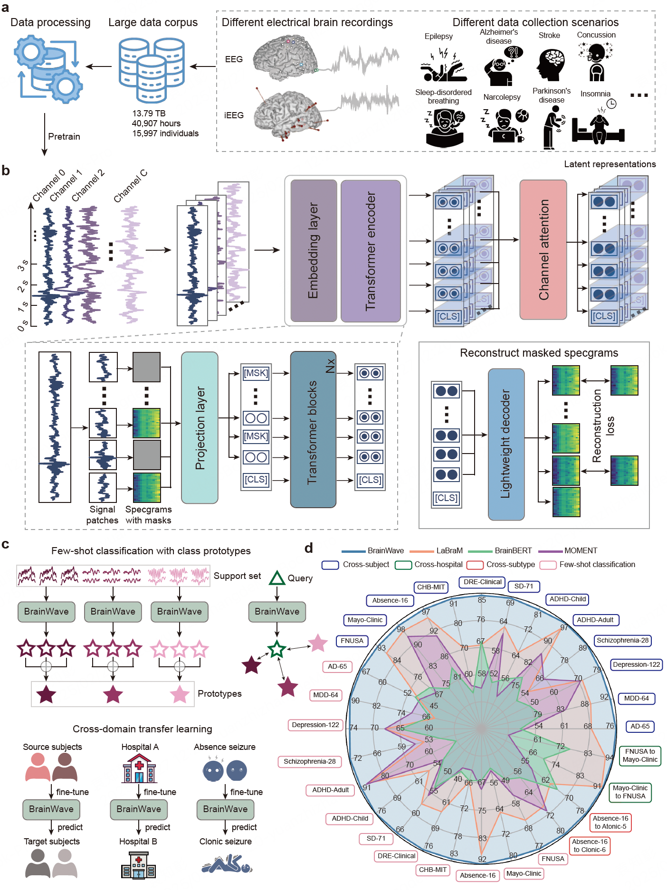

# BrainWave: A Brain Signal Foundation Model for Clinical Applications

**The latest version of the manuscript is under review, we will release the code and weights upon publication. Here is the citation of the preprint version: **

```
@misc{yuan2024brainwavebrainsignalfoundation,
      title={BrainWave: A Brain Signal Foundation Model for Clinical Applications}, 
      author={Zhizhang Yuan and Fanqi Shen and Meng Li and Yuguo Yu and Chenhao Tan and Yang Yang},
      year={2024},
      eprint={2402.10251},
      archivePrefix={arXiv},
      primaryClass={q-bio.NC},
      url={https://arxiv.org/abs/2402.10251}, 
}
```


###########################################################################################

## Introduction

BrainWave is the first foundation model for both invasive and non-invasive neural recordings, pretrained on more than 40,000 hours of electrical brain recordings (13.79 TB of data) from approximately 16,000 individuals. BrainWave outperforms other competing models and consistently achieves state-of-the-art performance in the diagnosis and identification of neurological disorders.




## Ethics Statement

The data collection and experiments conducted in our work on the private datasets (i.e., the pre-training SEEG corpus and the clinical dataset for seizure prediction) have been approved by the Institutional Review Board (IRB) and passed ethical review. All participants have signed informed consent forms. All publicly available datasets used in this paper are not associated with any privacy or security concerns. Furthermore, we have followed guidelines on responsible use specified by the primary authors of the datasets used in the current work.

