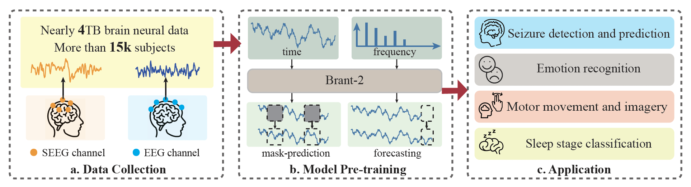

# Brant-2

**This project is currently undergoing updates, so we decide to temporarily suspend the provision of model code and weights to the public. We apologize for any inconvenience this may cause.**

###########################################################################################

## Framework

Brant-2 is the first large-scale, off-the-shelf model that can be applied to the application scenrios of both SEEG and EEG. 

As shown in the figure below, to build such a foundation model, the first step is to gather a large amount of unlabeled SEEG and EEG data, which is then used for large-scale pre-training. For applications, the pre-trained Brant-2 can be served as an off-the-shelf model which can be applied to various downstream scenarios through fine-tuning.

## Performance

The figure below summarizes the overall results of Brant-2 compared with the baseline methods on all the downstream tasks. From the radar chart, it can be observed that Brant-2 outperforms all universal time series modeling methods and pre-training methods on brain signals, even surpassing a majority of scenario-specific methods, indicating that our method exhibits strong generalization ability across various scenarios of brain signals.

## Ethics Statement

The data collection and experiments conducted in our work on the private datasets (i.e., the pre-training SEEG corpus and the clinical dataset for seizure prediction) have been approved by the Institutional Review Board (IRB) and passed ethical review. All participants have signed informed consent forms. All publicly available datasets used in this paper are not associated with any privacy or security concerns. Furthermore, we have followed guidelines on responsible use specified by the primary authors of the datasets used in the current work.

